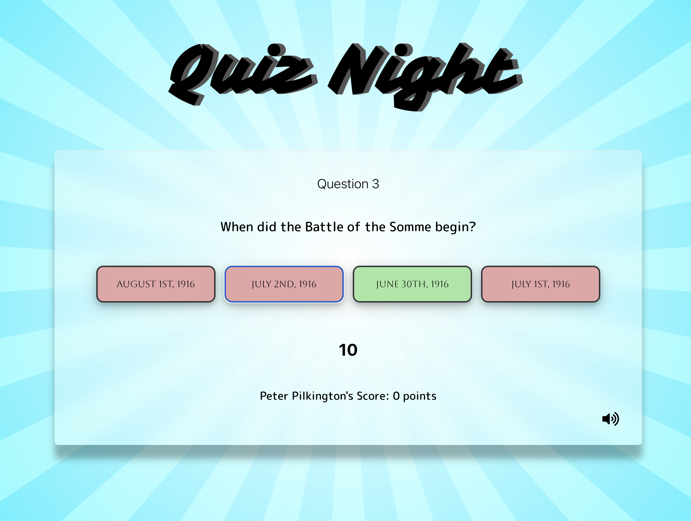

# Quiz Night




## Deployment 

:rocket: **Deployed** with Netlify at [quiz-night](https://quiz-night.netlify.app/)

[]([](https://app.netlify.com/sites/quiz-night/deploys))


## About

Quiz game with leaderboard, built with React that makes use of **React Router v6** & **MongoDB** to persist leaderboard data.

Backend is built in **Node.js** and deployed with Render. 

[quiz-night-backend](https://github.com/Pilks-pixel/QuizNightBackend)


## Instructions

Clone down to local machine, `npm install` and `cd quiz-night`

`npm start dev` to run in the development mode.

Open [http://localhost:3000](http://localhost:3000) to view it in your browser.


## Wins

-[x] Made use of **useRef** , **useState** , **useEffect** hooks with props to manage individual states of players and scores across components

-[x] Leaderboard implimented with backend API and **MongoDB** allowing data to persist between games.

-[x] Sounds and Win animations combined with dynamic question buttons give intuitive UI & UX.

-[x] **Responsive** on mobile and tablet with use of **flexbox** & **CSS grid**. 

-[x] **Accessibility**, all buttons are accessable by tabing and inputs labelled with use of ARIA tags.

## Future features

-[] Multiplayer with socket io.


## Significant code
```javascript

// Creates an array of all answers and places them in random order
    useEffect(() => {
        let answers = [...decodedIncorrectAnswer, decodedAnswer]
        answers.sort(() => Math.random() - 0.5)
        setAnswerOptions(answers)
    }, [props.question])

    console.log(answerOptions)

    // Iterates over the answerOptions array and generates a button for each one
    const answerBtnElements = answerOptions.map((a, index) => {
        return <button
            key={index}
            className={!props.selected ? " " : props.selected && a === decodedAnswer ? "correct" : "incorrect"}
            style={props.styles}
            onClick={() => props.newQuestion(a)}
            disabled={props.btnOff}

        >
            {a}</button>
    })

```
